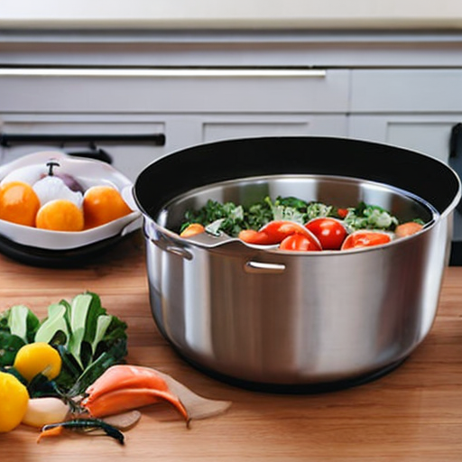

# Object Placement in Text-Conditioned Scenes

## Project Overview

This project leverages **Stable Diffusion Inpainting** to seamlessly place an object from an image with a white background into a text-conditioned scene. The primary goal is to create realistic product images for e-commerce applications, ensuring the object integrates naturally within the specified environment.

---

## Installation

### 1. Clone the Repository
To get started, clone the repository using the following command:

```bash
git clone https://github.com/abhinavkarnatak-dev/Avataar-Assignment.git
cd Avataar-Assignment
```

### 2. Install Dependencies

Ensure that you have `pip` installed, and then install the necessary dependencies by executing:

```bash
pip install -r requirements.txt
```

If `requirements.txt` is unavailable, you can manually install the required packages:

```bash
pip install torch diffusers accelerate transformers pillow
```

---

## Execution

To generate an image with an object placed in a text-conditioned scene, run the following command:

```bash
python run.py --image ./input_image.jpg --text-prompt "product in a kitchen used in meal preparation" --output ./generated.png
```

### Command-Line Arguments
- `--image`: Specify the path to the input image (which should contain the object on a white background).
- `--text-prompt`: Provide a descriptive text prompt to guide the generation of the background scene.
- `--output`: Indicate the file path where the final generated image will be saved.

---

## Example Command

Here’s an example command demonstrating how to use the script:

```bash
python run.py --image ./example.jpg --text-prompt "product in a kitchen used in meal preparation" --output ./generated.png
```

---

## Approach to Solving the Problem

### 1. Initial Setup
- The objective was to utilize a generative model to insert a product image into a scene dictated by a text prompt.
- I implemented **Stable Diffusion Inpainting** to create a mask for the object, allowing for the generation of an appropriate background.

### 2. Challenges in Achieving Realism
- **Aspect Ratio & Placement**: It was crucial to ensure that the object was correctly scaled and positioned naturally within the scene.
- **Lighting Consistency**: Maintaining consistent lighting and shadows between the object and the generated background proved to be a challenge.

---

## Results

### Example Image

<div>
    
</div>

### Generated Image

<div>
    
</div>

- The image successfully integrates the object into the scene, aligning with the provided prompt and exhibiting a realistic appearance.

---

## Challenges & Improvements

### Challenges Encountered
- **Aspect Ratio Issues**: Initial tests revealed improper scaling and placement of the object within the scene.
- **Lighting Inconsistency**: Some generated images displayed mismatched lighting between the object and the surrounding scene.

### Improvements Made
- Employed a more descriptive **text prompt** to enhance the relevance of the generated scene.
- Fine-tuned the **masking process** to better preserve the object's intricate details.

---

## Conclusion

This project showcases the potential of generative AI in automating product photography for e-commerce. While the results are promising, further refinements are essential to ensure better control over aspect ratio and lighting consistency, ultimately achieving a higher degree of realism.
```
